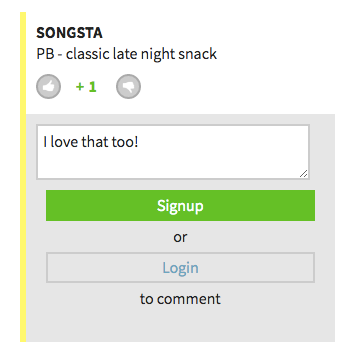
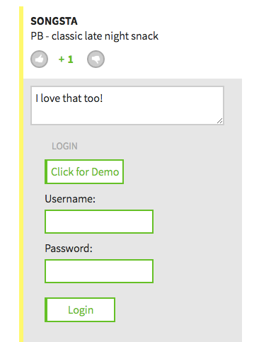
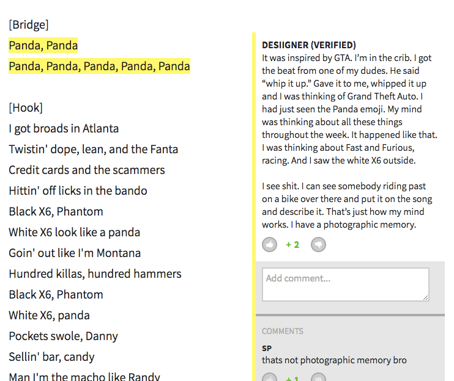

# So-Genius
A full-stack web application inspired by RapGenius.


So-Genius delivers RapGenius' signature highlight-based annotation and in-place login features. The snappy UI and entirely single-page architecture are achieved using React.js, Ruby on Rails and a Postgres database. Full site developed in two weeks.

Check out So-Genius [live here][production].

[production]: https://so-genius.com

## Features and Implementation


### Authentication: Fast, Secure, Ubiquitous
- Employs front-end authentication for faster login and signup
- Utilizes Devise for industry standard security in authentication/session management
- Users seamlessly sign up/login where they create content, rather than in a pesky popup or signin page





### Annotations: Keeping Track of Indices


- `Annotation` highlights are created and stored according to their start and end indices within lyrics text.
- At display time, highlights are populated as `<a>` tags within the lyrics display.
- To ensure future user selections are captured according to their indices in the original lyrics, rather than the mutated lyrics, a second, **transparent ghost layer** of lyrics collects user selections while highlights are displayed in the layer below.

Lyrics render method:
```
render() {
  return (
    <div>
      <div className="ghost-lyrics"
           id="ghost-lyrics"
           onMouseUp={this.props.onHighlight}
           onClick={this.handleClick}>
        {this.props.lyrics}
      </div>
      <div className="lyrics" id="lyrics">
        {this.props.populatedLyrics}
      </div>
    </div>
  );
}
```

### Popup Ballet: Orchestrating The Annotation Interface
When a user selects lyrics, a complicated popup ballet is initiated allowing the user to create and edit an annotation. The logic looks like this:

![popup-logic]

To simplify the complexity of the sequence, which involves 10+ components, I *centralize* user input and current selection information in a `Song` parent component, and *decentralize* display decisions to subcomponents that can intelligently render based on relevant context (login status, selected annotation id, etc.).

By delegating display logic among subcomponents, no single component needs to hold a large amount of state or concern itself with the display logic for other components.

For example:  
When a user selects an unannotated portion of the lyrics, the `Song` component renders an `Annotation` component with a `prop` `selectedAnnotationId` set to `null`. In the absence of a selected annotation, `Annotation` renders `AnnotationPrompt`.  

`AnnotationPrompt` listens to the `SessionStore`, which tells it the user is not logged in. It knows in this case to render `AuthPrompt`. `AuthPrompt` in turn handles the logic of displaying `Login` or `Signup` forms, which handle user signup.

The `AnnotationPrompt` however does not concern itself with this logic: all it cares is, as soon as there is a logged in user, unmount the `AuthPrompt` and render an `AnnotationForm`.  

### Eager Loading Comments and Upvotes
Almost all the content on ```So-Genius``` can be commented upon and upvoted (or downvoted). To achieve this, I used ```polymorphic``` associations between annotations/songs and their respective comments/votes. To reduce the number of queries and thus the database load, comments and upvotes are eager loaded when their parent is to be displayed.

Song `show` method:
```ruby
# songs_controller.rb

def show
  @song = Song.includes(
      :comments,
      :votes,
      comments: [:author, :votes])
    .find(params[:id])
end
```


## Ongoing Improvements

### Indexed Search
For full scale production, a more robust search infrastructure is needed that uses pre-indexed data to yield faster search results. I intend to implement `Elastic Search` indexing to replace current `SearchBar` behavior, to reduce server load during live search

### Refactor to Markdown-Based Lyrics
Index based annotations, while effective, result in less flexibility to edit lyrics and require extra song and dance during annotation. Storing lyrics in markdown allows annotations to be directly linked in the source lyrics text using `[selection](annotationId)` notation. This would allow lyrics to be edited without misaligning existing annotations.

[popup-logic]: ./docs/popup_logic.png
